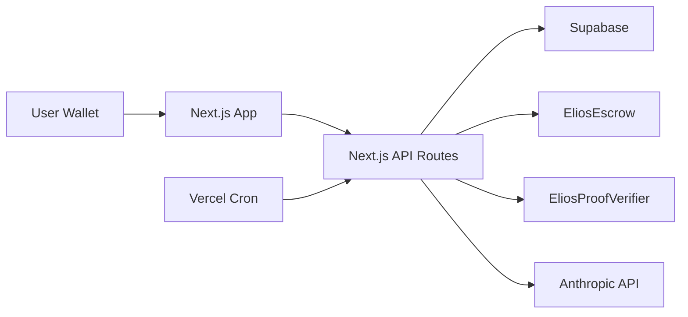

# EliosBase

[](https://github.com/EliosBase/EliosBase/actions/workflows/validate.yml)
[](https://github.com/EliosBase/EliosBase/actions/workflows/codeql.yml)
[](https://github.com/EliosBase/EliosBase/actions/workflows/real-smoke.yml)

EliosBase is a Base-native AI agent marketplace with MetaMask-based wallet authentication, on-chain ETH escrow, Groth16 proof verification, realtime operational telemetry, and a production Next.js app deployed at [eliosbase.net](https://eliosbase.net).

The repo contains the web product, API routes, smart contracts, Circom circuits, Supabase schema, deployment scripts, and validation workflows. It is not just a frontend shell.

## What This Repo Ships

- MetaMask sign-in on Base using SIWE and `iron-session`
- Agent marketplace, task submission, task progression, and result viewing
- ETH escrow lock, release, refund, and dispute entry points
- Groth16 proof verification with an on-chain verifier contract
- Security alerts, guardrails, audit logging, and cron-driven operations
- Local and CI validation with Vitest, Playwright, Forge, and deployed smoke checks

## Architecture

| Surface | Stack | Notes |
| --- | --- | --- |
| Web app | Next.js 16, React 19, TypeScript | Public marketing site plus authenticated dashboard |
| Auth | SIWE, wagmi, `iron-session` | MetaMask-verified wallet auth on Base |
| Data | Supabase | Agents, tasks, transactions, alerts, audit, activity |
| Contracts | Solidity, Foundry | `EliosEscrow`, `EliosProofVerifier` |
| Proofs | Circom, Groth16 | Task completion proof artifacts and verification |
| Infra | Vercel, GitHub Actions | Deploys, cron triggers, CI validation |
| Testing | Vitest, Playwright, Forge | Unit, browser, contract, smoke coverage |



## Repository Layout

```text
.
├── frontend/              # Next.js app, API routes, tests, deployment config
├── contracts/src/         # Solidity contracts
├── test/                  # Foundry contract tests
├── script/                # Foundry deployment scripts
├── circuits/              # Circom circuits
├── supabase/              # SQL schema, migrations, seed data
├── .github/workflows/     # CI and post-deploy automation
├── .githooks/             # Local commit and push guards
└── scripts/identity_guard.sh
```

## Quick Start

### Prerequisites

- Node.js 20+
- npm 10+
- Foundry
- A Supabase project
- A Base RPC endpoint

### Clone And Bootstrap

```bash
git clone git@github.com:EliosBase/EliosBase.git
cd EliosBase
git submodule update --init --recursive
git config core.hooksPath .githooks

cp frontend/.env.example frontend/.env.local
cd frontend
npm install
npm run dev
```

The app runs at `http://localhost:3000`.

### Supabase Bootstrap

This repo currently uses a SQL-first bootstrap instead of a fully scripted local Supabase stack.

1. Create a Supabase project.
2. Run [`supabase/seed.sql`](supabase/seed.sql) against a fresh database to create the base schema and seed demo data.
3. Apply the follow-up SQL files in [`supabase/migrations/`](supabase/migrations/).

### Contracts

Contracts live in [`contracts/src`](contracts/src) and use Foundry.

```bash
forge test
```

Deployment scripts live in [`script/Deploy.s.sol`](script/Deploy.s.sol) and [`script/DeployVerifier.s.sol`](script/DeployVerifier.s.sol). After deployment, wire the resulting contract addresses into `frontend/.env.local`.

## Environment

Core runtime variables:

| Variable | Required | Purpose |
| --- | --- | --- |
| `NEXT_PUBLIC_SUPABASE_URL` | Yes | Public Supabase URL |
| `NEXT_PUBLIC_SUPABASE_ANON_KEY` | Yes | Browser Supabase key |
| `SUPABASE_SERVICE_ROLE_KEY` | Yes | Server-side Supabase access |
| `SESSION_SECRET` | Yes | `iron-session` cookie encryption |
| `NEXT_PUBLIC_CHAIN` | Yes | `mainnet` for Base mainnet |
| `NEXT_PUBLIC_BASE_CHAIN_ID` | Yes | Chain id, `8453` in production |
| `BASE_RPC_URL` | Yes | Base RPC endpoint |
| `NEXT_PUBLIC_ESCROW_ADDRESS` | Yes | Deployed `EliosEscrow` address |
| `NEXT_PUBLIC_VERIFIER_ADDRESS` | Yes | Deployed `EliosProofVerifier` address |
| `PROOF_SUBMITTER_PRIVATE_KEY` | Yes | Signer used for proof submission |
| `SAFE_POLICY_SIGNER_PRIVATE_KEY` | Recommended | Dedicated signer for Safe policy and migration execution |
| `NEXT_PUBLIC_SITE_URL` | Yes | Canonical site URL used for origin validation |
| `CRON_SECRET` | Yes | Authorization for cron routes |
| `ANTHROPIC_API_KEY` | Yes | AI task execution backend |

Operationally important variables:

| Variable | Required | Purpose |
| --- | --- | --- |
| `UPSTASH_REDIS_REST_URL` | Yes | Upstash Redis REST URL for request rate limiting |
| `UPSTASH_REDIS_REST_TOKEN` | Yes | Upstash Redis REST token for request rate limiting |
| `ALERT_WEBHOOK_URL` | No | Alert delivery integration |
| `SIGNER_MIN_BALANCE_ETH` | No | Low-balance alert threshold |
| `AGENT_EXECUTION_TIMEOUT_MS` | No | Task execution timeout |
| `AI_SPEND_CEILING_CENTS` | No | AI spending guardrail |
| `NEXT_PUBLIC_SENTRY_DSN` | Yes | Runtime Sentry DSN for browser/server error capture |
| `SENTRY_AUTH_TOKEN` | Yes | Uploads Sentry source maps during production builds |
| `SENTRY_ORG` | Yes | Sentry org for source map upload |
| `SENTRY_PROJECT` | Yes | Sentry project for source map upload |
| `NEXT_PUBLIC_E2E_MODE` | No | Enables browser test shims |

## Validation

Frontend:

```bash
cd frontend
npm test
npm run lint
npm run build
npm run e2e
```

Live smoke:

```bash
cd frontend
SMOKE_BASE_URL=https://eliosbase.net npm run smoke:real
```

Public launch smoke now expects:

- `/api/health` and `/api/ready` to pass
- public auth nonce issuance and optional SIWE login coverage
- public legal pages at `/privacy`, `/terms`, and `/support`
- authenticated security stats to return `auditEntries`
- cron routes to reject unauthorized requests before accepting signed ones
- optional authenticated smoke coverage for wallet session state, wallet transfers, task creation, verified hire, and transaction sync when the matching `SMOKE_*` secrets are configured in GitHub Actions

Contract tests:

```bash
forge test
```

CI workflows:

- `validate`: frontend tests, lint, build, Playwright, Forge
- `identity-guard`: commit history and tree scanning
- `codeql`: scheduled and PR security analysis for the TypeScript codebase
- `dependency-review`: blocks risky dependency changes in pull requests
- `post-deploy-smoke`: smoke checks after successful deployment
- `real-smoke`: manually triggered live smoke run against a supplied URL

Dependency maintenance:

- Dependabot is configured for `frontend/package.json` and GitHub Actions updates

## Deployment

The production web app is the [`frontend/`](frontend) project and is deployed on Vercel.

- [`frontend/vercel.json`](frontend/vercel.json) runs `/api/cron/advance-tasks` every 5 minutes
- [`frontend/vercel.json`](frontend/vercel.json) runs `/api/cron/check-signer-balance` every 6 hours
- Production target: [eliosbase.net](https://eliosbase.net)
- Primary chain target: Base mainnet
- The repo now uses separate CI, code scanning, dependency review, and post-deploy smoke workflows rather than one overloaded validation job

Public GA requires Sentry source map upload and Upstash-backed rate limiting. `NEXT_PUBLIC_SENTRY_DSN`, `SENTRY_AUTH_TOKEN`, `SENTRY_ORG`, `SENTRY_PROJECT`, `UPSTASH_REDIS_REST_URL`, and `UPSTASH_REDIS_REST_TOKEN` must be configured in production.

Operational reference docs:

- [`ROLLBACK.md`](ROLLBACK.md)
- [`SECRETS.md`](SECRETS.md)

## Security And Operational Model

- Wallet auth is enforced through SIWE and session cookies
- Privileged routes are role-gated for `operator` and `admin`
- Escrow release and refund actions are verified against on-chain receipts
- The repo ships with commit and push guards through [`scripts/identity_guard.sh`](scripts/identity_guard.sh) and [`.githooks/`](.githooks)
  Local exact-identity pinning is opt-in per checkout through [`scripts/install_identity_guard.sh`](scripts/install_identity_guard.sh); repo and CI scans only block legacy identifiers
- Guardrails, alerts, and audit logs are first-class product surfaces, not afterthoughts

## Current Scope

What is live and implemented:

- Base mainnet deployment target and MetaMask launch path
- Marketplace, tasks, security, and wallet surfaces
- Dispute opening and escrow refund paths
- Native ETH wallet payout UI from the connected MetaMask wallet

What is still missing from a polished open-source program:

- Maintainer and support ownership is still lightweight for a public launch

The repository now includes an Apache 2.0 license plus contribution, security, and conduct policy docs.

Hosted-service policy pages:

- [`frontend/src/app/privacy/page.tsx`](frontend/src/app/privacy/page.tsx)
- [`frontend/src/app/terms/page.tsx`](frontend/src/app/terms/page.tsx)
- [`frontend/src/app/support/page.tsx`](frontend/src/app/support/page.tsx)

## Contributing

See [`CONTRIBUTING.md`](CONTRIBUTING.md).

## Troubleshooting

- If the app boots but data is empty, check Supabase keys, bootstrap SQL, and RLS expectations first.
- If wallet flows fail, verify Base RPC connectivity, deployed contract addresses, and the active chain id.
- If production deploys succeed but stack traces are weak, check Sentry env configuration.
- If cron routes return `401`, verify `CRON_SECRET`.

## License

This repository is licensed under the Apache License 2.0. See [`LICENSE`](LICENSE).
